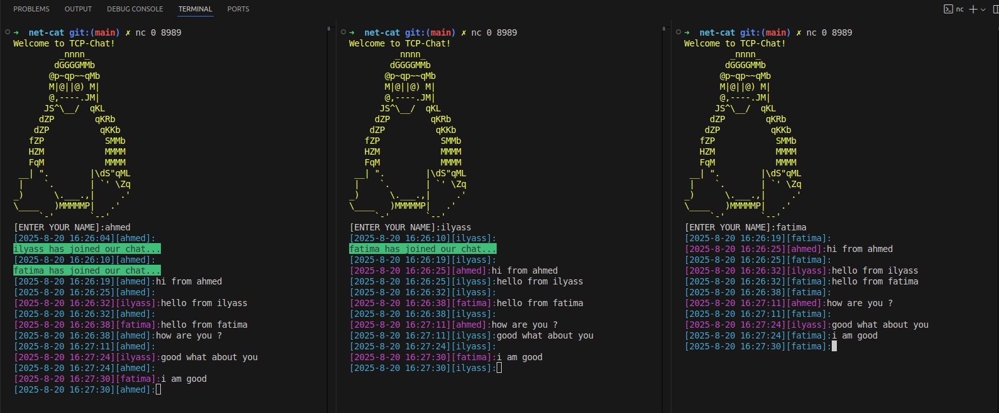

# Net-Cat
A simple TCP chat program inspired by **netcat**, written in Go.



# Team members :
- Ahmed Talbi
- Ilyass Aboudou
- Fatima Aaziz

## Usage
1. Start the server:
   ```bash
   go run server.go
   ```

   Default address: 127.0.0.1:8989

2. Connect with client(s):
   ```bash
   nc 127.0.0.1 8989
   ```

## Features
- Accepts multiple concurrent client connections using goroutines.
- Broadcasts messages from any client to all others.
- Notifies when users join or leave.
- Handles input scanning safely with error detection.

## Example
```
Client A: Hello everyone!
Client B: Hi A!
[system]: Client C has left our chat...
```

## Structure 

```
net-cat/
│── assets/
│ └── history.txt
│
│── logic/
│ ├── Connection.go
│ ├── helpers.go
│ ├── listenMSG.go
│ ├── message.go
│ ├── models.go
│ └── welcome.go
│
│── main.go
│── go.mod
│── README.md
```
